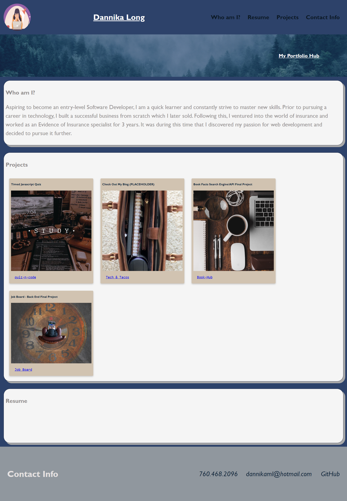

# overlord-phase-one

## Portfolio Hub
***
### Description
This web application serves as the online portfolio of Dannika Long, showcasing her proficiency in web development. Designed as a centralized hub, the GitHub Repository links to website and web pages developed by Dannika Long, effectively highlighting her skillset in the field of web development.

### Usage
***
The purpose of this webpage is to create a centralized hub for all the web applications and pages developed using different technologies. The webpage is designed to provide a tidy and comprehensive display of the portfolio work created by me, which can be accessed by anyone who is interested in viewing or assessing my work.

### Technologies Used
- HTML
- CSS

### Project Status
***
In progress and to be updated frequently.